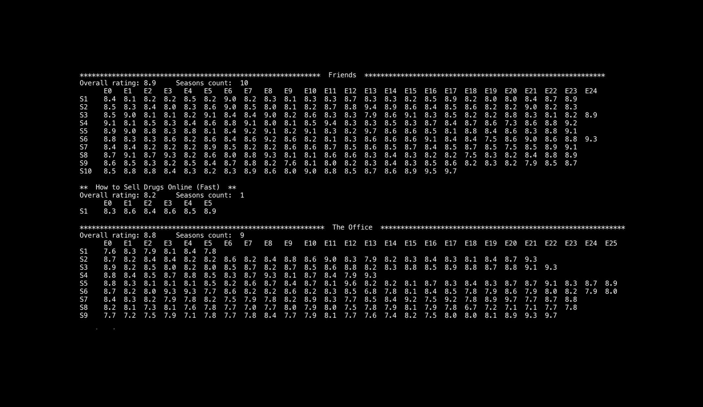

# IMDb Analytics

This project aims to use various ways to help you explore IMDb in a visually
fun way. Users are able to see trends of a TV Series' episode ratings (so they
can easily idenfify flops such as Game of Thrones), see our predictions on
whether a TV show / Movie will succeed commercially, explore our recommendations
based on your search history, and more.

I use this project to explore Microservices architecture, the inner-workings of
a recommendation engine, predictions through data mining, how a resilient
internet scraper is built, and CI/CD (Continuous Integration / Continuous
Deployment) best practices.

## Screenshots

| Web App                             | CLI                                      |
| ----------------------------------- | ---------------------------------------- |
|  |  |

## Motivations

I visit IMDb almost on a daily basis. I use it to find new movies, look up
critic reviews for TV episodes, and check out fun trivias for TV shows that I
watch. While I love the service for how comprehensive and relevant it is, I
thought the site's UI could use some improvement. Hence this projec, an attempt
to provide a better interface for dealing with IMDb's data.

## Architecture

The application is organized as a series of microservices that communicates with
each other using RPC or RESTful API.

### Services manifest

| Service | Written In         | API | Description                                                                       |
| ------- | ------------------ | --- | --------------------------------------------------------------------------------- |
| [Web App](./src/web-app) | Typescript (React) | N/A | The front-end of the application. Users use it to interact with various services. |
| [DB Service](./src/db-service) | Python | REST | Provides an interface for interacting with MongoDb, where IMDb data is stored |
| [Extractor Service](./src/extractor-service) | Python | RPC | Extracts queried information from IMDb |
| [Job Service](./src/job-service) | Go | RPC | Schedules data extraction jobs, controlls extraction frequency, etc. |
| Recommendation Service | Python | TBD | _To be implemented_. Recommends IMDb entries based on search history (stored locally) |
| Prediction Service | Python | TBD | _To be implemented_. Predicts whether an unreleased movie / TV season would succeed commercially and/or critically. 
| User Service | TBD | TBD | _Proposed, not confirmed_. Allows users to log in using SSO (Google, Facebook, etc.), or to create an account.|
| Favorites Service | TBD | TBD | _Proposed, not confirmed._ Gives users the ability to save items into lists (like pinterest. |

## Learning goals

Originally intended to be a lightweight IMDb scraper, this project has evolved
into a microservices learning experience. In this project, I hope to learn more
about:

- Microservices architectural design
  - Designation of responsibilities
  - Well-defined data flows (Istios)
  - Abstraction of common infrastructure
  - etc.
- Docker containerization
- Inter-container communication (RESTful vs. RPC)
- Container orchestration (Kubernetes)
- Golang and its advantages in concurrency
- CI / CD

## Trying out the application locally

This project is currently under development. To test the application on your
host machine, you may follow the commands below. Note that some of the
following instructions are unix-specific.

Before tesing, please ensure the following dependencies are installed:

- [docker](https://docs.docker.com/v17.12/docker-for-mac/install/#download-docker-for-mac)
- [brew](https://brew.sh)
- [node](https://treehouse.github.io/installation-guides/mac/node-mac.html)

To start up the environment, go to the root directory and run

```bash
make run-demo   # starts up the environment and loads sample data
# or
make run        # starts up the environment, without loading sample data
```

You should be able to access the web app at port 3001 (http://localhost:3001)
now.

Each service runs in a separate container. If you're interested in making
REST-ful calls to a service (provided REST-ful APIs are available), use the
following command to see the mappings between containers' and the host's ports:

```
docker container ls
```
